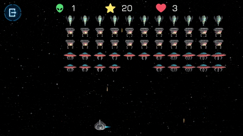
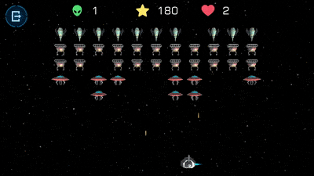

<div align="center">

# 🚀 Spaceship Battle

<table>
  <tr>
    <td></td>
    <td></td>
  </tr>
</table>

### ⚔️ *3D Space Shooter — Rebuilt from Scratch. Zero Shortcuts.* ⚔️

<br/>

[](https://unity.com/)
[](https://learn.microsoft.com/en-us/dotnet/csharp/)
[](https://xchrmas.github.io/Spaceship-Battle/)
[]()
[]()

<br/>

> **Not just another Unity shooter. This is a precision-engineered combat system —**
> **built with production-grade architecture, zero magic numbers, and zero compromise.**

</div>

---

## 🏗️ Architecture

This project is built **entirely from scratch** with a deliberate, opinionated architecture.
No bloated frameworks. No shortcuts. Every system earns its place.

```
┌─────────────────────────────────────────────────────────────────────┐
│                        ARCHITECTURE OVERVIEW                         │
├──────────────────────────┬──────────────────────────────────────────┤
│  Pattern                 │  MVP (Model · View · Presenter)           │
│  Dependency Injection    │  Custom Service Locator  ← zero external  │
│  Enemy Behaviour         │  Finite State Machine (FSM)               │
│  Object Pooling          │  HashSet — O(1) acquire & release         │
│  Event System            │  Native C# events  ← zero UniRx           │
│  Configuration           │  GameConstants  ← zero magic numbers      │
└──────────────────────────┴──────────────────────────────────────────┘
```

### Why these choices?

| Decision | What was rejected | Why |
|---|---|---|
| **Custom Service Locator** | Zenject / VContainer | Full control, zero overhead, no reflection magic |
| **Native C# events** | UniRx / R3 | Readable, debuggable, no hidden allocations |
| **HashSet Object Pool** | Unity's built-in pool | O(1) contains-check, no array bounds |
| **GameConstants** | Scattered magic numbers | Single source of truth, refactor-safe |
| **MVP** | MonoBehaviour spaghetti | Testable, decoupled, scalable |

---

## 🛠️ Tech Stack

### Engine & Language
[](https://unity.com/)
[](https://learn.microsoft.com/en-us/dotnet/csharp/)
[](https://unity.com/features/shader-graph)
[](https://www.jetbrains.com/rider/)

### Unity Packages
[](https://docs.unity3d.com/Packages/com.unity.addressables@latest)
[](https://github.com/Cysharp/UniTask)
[](http://dotween.demigiant.com/)

```
┌─────────────────────────────────────────────────────────────────────┐
│  Addressables  →  Runtime asset loading, memory-efficient bundles    │
│  UniTask       →  Zero-allocation async/await on Unity's main thread │
│  DOTween       →  High-performance tweening for UI & VFX             │
│  Shader Graph  →  Node-based custom shaders (shields, thruster FX)   │
└─────────────────────────────────────────────────────────────────────┘
```

---

## ✨ Core Systems

### 🔧 Service Locator
Zero external dependencies. Services register themselves on Awake, consumers resolve at Start. Clean, fast, no reflection.

```csharp
// Registration
ServiceLocator.Register<IWeaponService>(this);

// Resolution
var weapons = ServiceLocator.Get<IWeaponService>();
```

### ♻️ Object Pool — HashSet O(1)
Enemies, bullets, VFX — all pooled. `HashSet<T>` means O(1) acquire/release with instant duplicate detection.

```csharp
// No List.Contains() == no O(n) scan
_activeObjects.Add(obj);    // O(1)
_activeObjects.Remove(obj); // O(1)
```

### 🤖 Enemy FSM
Every enemy is a state machine. States are self-contained, transitions are explicit.

```
  [Idle] ──► [Patrol] ──► [Chase] ──► [Attack]
                              ▲            │
                              └────────────┘
                                  [Dead]
```

### 📡 C# Events — Zero Allocations
No UniRx observables, no lambdas stored on heap. Struct-based event args keep GC pressure at zero.

```csharp
public static event Action<EnemyDeathArgs> OnEnemyDied;
```

### 📦 Addressables
Assets load asynchronously via labels. Memory is released the moment a scene unloads — no stale references.

### ⚡ UniTask
`async/await` without the Unity coroutine ceremony. Cancellation tokens on every async flow. Zero thread switches.

### 🎨 Shader Graph
Custom URP shaders for thruster glow, shield dissolve, hit flash, and deep-space backgrounds — all node-based, artist-friendly.

---

## 🚀 Getting Started

### 🎮 Play in Browser

```
Open: /WebGL_Build/index.html
```

No install. No plugin. Open in any modern browser and fight.

### 🖥️ Open in Unity

```bash
git clone https://github.com/xchrmas/Spaceship-Battle.git
```

Then: **Unity Hub → Add → Select cloned folder**

> Requires Unity **2022.x** or newer with **URP** enabled.

---

## 🎯 Controls

```
  W / ↑  ───── Move Forward          LEFT CLICK ── Fire
  S / ↓  ───── Move Backward         MOUSE ─────── Aim
  A / ←  ───── Strafe Left           ESC ────────── Pause
  D / →  ───── Strafe Right
```

---

## 📁 Project Structure

```
Spaceship-Battle/
│
├── 📁 Assets/
│   ├── Scripts/
│   │   ├── Architecture/   → ServiceLocator, GameConstants
│   │   ├── MVP/            → Models, Views, Presenters
│   │   ├── Pool/           → HashSet ObjectPool
│   │   ├── FSM/            → Enemy states & transitions
│   │   └── Systems/        → Weapons, Health, Scoring
│   │
│   ├── Shaders/            → Shader Graph assets (URP)
│   ├── Prefabs/            → Addressable prefabs
│   └── Scenes/
│
├── 📁 Packages/            → Addressables, UniTask, DOTween
├── 📁 WebGL_Build/         → 🎮 index.html — play now
└── 📁 ProjectSettings/
```

---

## 🗺️ Roadmap

```
[✅] MVP Architecture
[✅] Custom Service Locator
[✅] HashSet Object Pool
[✅] Enemy FSM
[✅] C# event system
[✅] GameConstants
[✅] Addressables integration
[✅] UniTask async pipeline
[✅] DOTween animations
[✅] Shader Graph VFX
[✅] WebGL Build

[ ] Multiple enemy types
[ ] Boss fights
[ ] Weapon upgrade system
[ ] Score & leaderboard
[ ] Audio system
[ ] Multiplayer (PvP)
```

---
</div>
